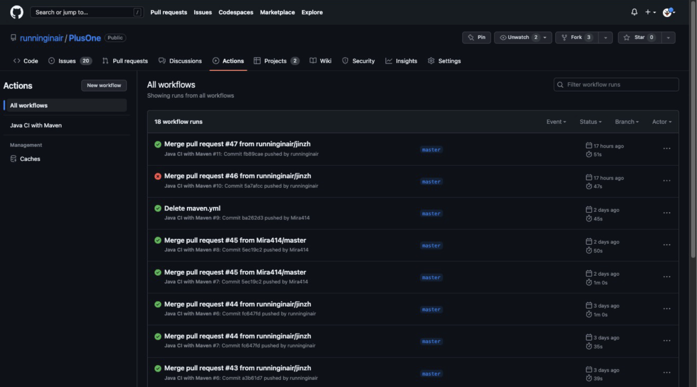

# PlusOne 

Welcome to our project! This Spring Boot application provide workout track and evaluation services. 
* Team members: Tao Jin, Meng Wang, Mingyang Wang, Jin Zhang

## Architecture

The application provides CRUD services of activities and users. It uses MySQL database to store the data. 

If your database connection properties work, you can call some REST endpoints defined in ```com.example.controller``` on **port 8080**. (see below)

You can use this sample service to understand the conventions and configurations that allow you to create a standard RESTful service. Once you understand and get comfortable with the sample app you can add your own services following the same patterns as the sample service.

Here is what this little application demonstrates:

* Full integration with the latest **Spring** Framework: inversion of control, dependency injection, etc.
* Writing a RESTful service using annotation: supports JSON request / response
* *Spring Data* Integration with JPA/Hibernate with just a few lines of configuration and familiar annotations.
* Automatic CRUD functionality against the data source using Spring *Repository* pattern
* Demonstrates MockMVC test framework with associated libraries

Here are some endpoints you can call:

**GET** get activities by user ID & date
```agsl
https://plusone-backend.herokuapp.com/activities/{uid}/date/{date}
```

**GET** get total distance by time range for a user
```agsl
https://plusone-backend.herokuapp.com/activities/user/{userId}/distance/start/{start}/end/{end}
```

**GET** get total calories by time range for a user
```agsl
https://plusone-backend.herokuapp.com/activities/user/{userId}/calories/start/{start}/end/{end}
```

**GET** get user information by username
```agsl
https://plusone-backend.herokuapp.com/users/name/{userName}
```

**POST** creat new activity (parameters passed by JSON)
```agsl
https://plusone-backend.herokuapp.com/activities
```

**DEL** delete user by username
```agsl
https://plusone-backend.herokuapp.com/users/name/{userName}
```

**PUT** update user height by user id
```agsl
https://plusone-backend.herokuapp.com/users/id/{userID}/height/{newHeight}
```

**PUT** update user weight by user id
```agsl
https://plusone-backend.herokuapp.com/users/id/{userID}/weight/{newWeight}
```

### An authorized frontend is a React application (For more info about the frontend please refer to the URL):
```
https://github.com/runninginair/Plus1-APP
```


## Deployed frontend and backend urls
```
https://plusone-frontend.herokuapp.com/home
https://plusone-backend.herokuapp.com/
```

## Prerequisite
Make sure your Java version is equal or higher than 17.
```agsl
Java, version 17
Spring Boot, version 3.0.2
Maven, version 4.0.0

// for test
Junit, version 4.13.2
Mockito, version 3.11.2
Jacoco, version 0.8.7
```


## How to Run

This application is deployed in Heroku.com.
For connection details, please refer to follows application.yml

* Clone this repository
* You can build the project and run the tests by running 
```
mvn clean package
mvn test package
```


* Once successfully built, you should see something like this:
```agsl
[INFO] Scanning for projects...
[INFO] 
[INFO] -------------------------< com.example:demo1 >--------------------------
[INFO] Building demo1 0.0.1-SNAPSHOT
[INFO] --------------------------------[ jar ]---------------------------------
[INFO] 
[INFO] --- maven-clean-plugin:3.2.0:clean (default-clean) @ demo1 ---
[INFO] Deleting .../PlusOne/target
[INFO] ------------------------------------------------------------------------
[INFO] BUILD SUCCESS
[INFO] ------------------------------------------------------------------------
[INFO] Total time:  0.173 s
[INFO] Finished at: 2023-04-23T20:19:57-07:00
[INFO] ------------------------------------------------------------------------

Process finished with exit code 0

```

* After running the tests, you should expect to see something similar to the following output.
```
[INFO] Tests run: 5, Failures: 0, Errors: 0, Skipped: 0, Time elapsed: 0.021 s - in com.example.services.ActivityServiceTest
2023-04-23T20:21:04.932-07:00  INFO 61382 --- [ionShutdownHook] j.LocalContainerEntityManagerFactoryBean : Closing JPA EntityManagerFactory for persistence unit 'default'
2023-04-23T20:21:05.026-07:00  INFO 61382 --- [ionShutdownHook] com.zaxxer.hikari.HikariDataSource       : HikariPool-1 - Shutdown initiated...
2023-04-23T20:21:06.398-07:00  INFO 61382 --- [ionShutdownHook] com.zaxxer.hikari.HikariDataSource       : HikariPool-1 - Shutdown completed.
[INFO] 
[INFO] Results:
[INFO] 
[INFO] Tests run: 63, Failures: 0, Errors: 0, Skipped: 0
[INFO] 
[INFO] 
[INFO] --- jacoco-maven-plugin:0.8.7:report (report) @ demo1 ---
[INFO] Loading execution data file .../PlusOne/target/jacoco.exec
[INFO] Analyzed bundle 'demo1' with 7 classes
[INFO] ------------------------------------------------------------------------
[INFO] BUILD SUCCESS
[INFO] ------------------------------------------------------------------------
[INFO] Total time:  10.223 s
[INFO] Finished at: 2023-04-23T20:21:06-07:00
[INFO] ------------------------------------------------------------------------

Process finished with exit code 0

```


# Retrieve data with MySQL Workbench

Here is what you would do to back the services with MySQL WorkBench, for example:

1. Create a new MySQL Connection;
2. Username: ${YOUR_MYSQL_USERNAME}     Hostname: ${YOUR_MYSQL_HOSTNAME}    Port: 3306   
3. Test Connection, once it connects well. click "OK".

### In pom.xml add:

```
   <dependency>
     <groupId>com.mysql</groupId>
     <artifactId>mysql-connector-j</artifactId>
   </dependency>
```

### Modify application.yml as below:

```
spring:
  jpa:
    hibernate:
      ddl-auto: update
    show-sql: true
  datasource:
    #url: jdbc:mysql://${MYSQL_HOST}:${MYSQL_HOST_PORT}/${DB_NAME}
    #username: ${DB_USERNAME}
    #password: ${DB_PASSWORD}
    hikari:
      max-lifetime: 20000

    driver-class-name: com.mysql.cj.jdbc.Driver
  servlet:
    multipart:
      max-request-size: 50MB
      max-file-size: 40MB
```

## Code/Test metrics summary

### 1. API testing by Postman
All APIs passed Postman test, here is one sample of testing snap shot about “Get user by Username”:


### 2. Code Metrics by CodeMR


### 3. JUnit test by JaCoco


## CI Pipeline
The code will be automatically built and test when there is push action on master branch.



### THE END